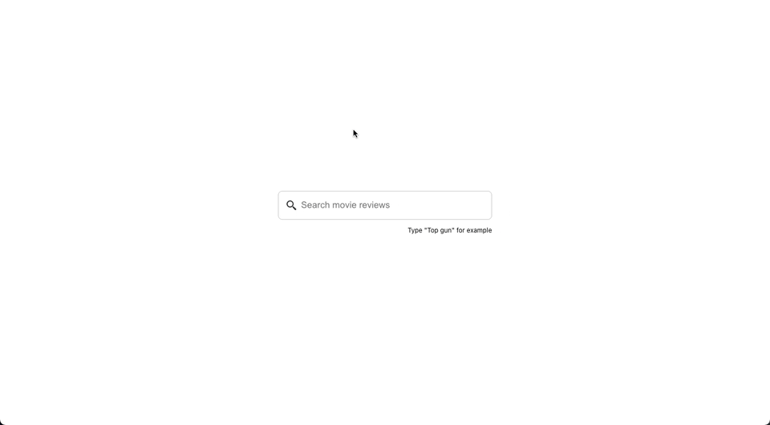

# Movies Search

The goal of this project is to search autocomplete movie reviews from New York Times API.


## Running the project (npm or yarn)

```
npm i
```

```
npm start
```

Runs the app in the development mode.\
Open [http://localhost:3000](http://localhost:3000) to view it in the browser.

## Environments

Please, set your own environment local using `.env.local` based on the params in `.env`

```
REACT_APP_API_URL="<<URL_HERE>>"
REACT_APP_API_KEY="<<TOKEN_HERE>>"
```

## Configuring the API (The New York Times)

To test using a real API, you can set up a new account on https://developer.nytimes.com/ following the steps bellow:


After registered a new app, you need to copy the key

